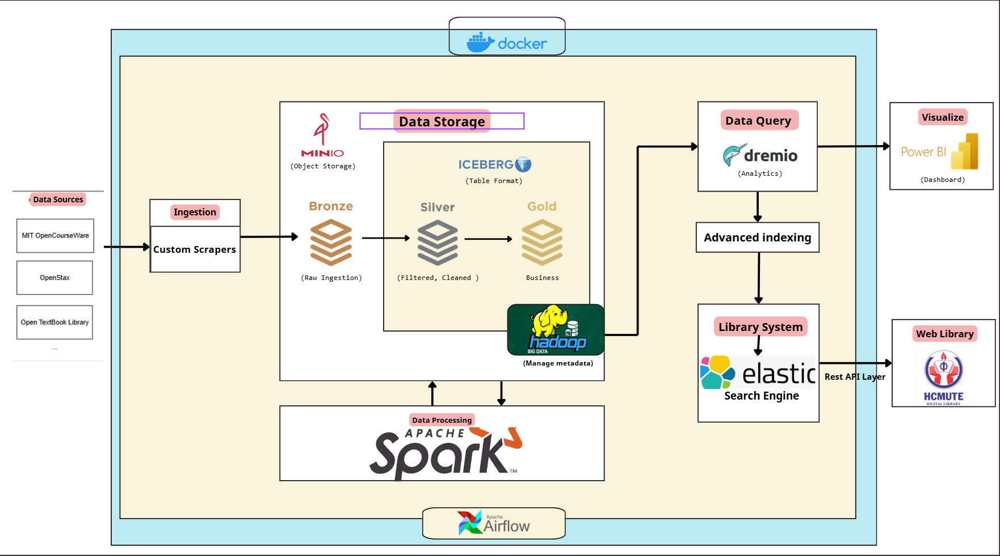

# OER Lakehouse - Hệ thống Quản lý Tài nguyên Giáo dục Mở

## Giới thiệu

**OER Lakehouse** là giải pháp toàn diện để giải quyết bài toán phân mảnh tài liệu giáo dục mở. Hệ thống tự động thu thập, xử lý và tổ chức tài liệu từ nhiều nguồn (MIT OCW, OpenStax, Open Textbook Library), kết hợp với **DSpace 9** để quản lý kho lưu trữ số và cung cấp khả năng tìm kiếm thông minh cấp độ trang PDF.

### Vấn đề giải quyết

- **Phân mảnh dữ liệu**: Tài liệu OER nằm rải rác trên nhiều nền tảng
- **Khó tìm kiếm**: Không thể tìm kiếm nội dung bên trong PDF
- **Thiếu gợi ý**: Không có hệ thống recommend phù hợp với chương trình đào tạo
- **Không thống nhất**: Metadata không đồng nhất giữa các nguồn


## Tính năng chính

### 1. Thu thập tự động (Web Scraping)

- Tự động crawl từ **MIT OpenCourseWare**, **OpenStax**, **Open Textbook Library**
- Tải PDF và trích xuất metadata
- Lên lịch chạy định kỳ với Apache Airflow

### 2. Kiến trúc Data Lakehouse (Medallion Architecture)

| Layer      | Mô tả                          | Format         |
| ---------- | ------------------------------ | -------------- |
| **Bronze** | Dữ liệu thô (JSON, PDF)        | MinIO (S3)     |
| **Silver** | Dữ liệu đã làm sạch, chuẩn hóa | Apache Iceberg |
| **Gold**   | Star Schema cho analytics      | Apache Iceberg |

### 3. Tìm kiếm thông minh (Deep PDF Search)

- **Nested PDF Indexing**: Index nội dung từng trang PDF riêng biệt
- **Smart Header/Footer Removal**: Tự động loại bỏ header/footer lặp lại
- **Gaussian Decay Scoring**: Ưu tiên tài liệu mới hơn
- **Highlight Snippets**: Hiển thị ngữ cảnh xung quanh từ khóa

### 4. Hệ thống Gợi ý (Recommendation Engine)

- **Content-based Filtering**: Gợi ý dựa trên nội dung tương tự
- **Semantic Matching**: Mapping tài liệu với môn học theo chương trình đào tạo
- **Personalized Recommendations**: Gợi ý theo ngành/khoa của sinh viên

### 5. Tích hợp DSpace 9

- **SAF Import**: Tự động import tài liệu vào DSpace
- **REST API Integration**: Đồng bộ metadata với DSpace
- **Angular Frontend**: Giao diện DSpace Angular với custom theme

### 6. Rating & Review

- Đánh giá và bình luận tài liệu
- Liên kết với tài khoản DSpace (eperson)
- Thống kê rating và helpful votes

---

## Sơ đồ Kiến trúc Hệ thống


---

## Tech Stack

| Component          | Technology     | Version |
| ------------------ | -------------- | ------- |
| **Data Storage**   | MinIO          | Latest  |
| **Table Format**   | Apache Iceberg | 1.4.2   |
| **Processing**     | Apache Spark   | 3.5.4   |
| **Orchestration**  | Apache Airflow | 2.x     |
| **Search Engine**  | Elasticsearch  | 8.15    |
| **Repository**     | DSpace         | 9.x     |
| **Backend API**    | FastAPI        | Latest  |
| **Frontend**       | DSpace Angular | 9.1     |
| **Database**       | PostgreSQL     | 17      |
| **Infrastructure** | Docker Compose | Latest  |

---

## Cấu trúc Dự án

```
TLCN_OER_Lakehouse/
├── airflow/
│   ├── dags/                           # Airflow DAG definitions
│   │   ├── mit_ocw_scraper_dag.py      # MIT OCW scraper
│   │   ├── openstax_scraper_dag.py     # OpenStax scraper
│   │   ├── otl_scraper_dag.py          # Open Textbook Library scraper
│   │   ├── silver_layer_processing_dag.py
│   │   ├── gold_layer_processing_dag.py
│   │   ├── elasticsearch_sync_dag.py
│   │   └── dspace_saf_import_dag.py    # DSpace import
│   ├── src/                            # Processing modules
│   │   ├── bronze_*.py                 # Bronze layer scrapers
│   │   ├── silver_transform.py         # Silver layer ETL
│   │   ├── gold_analytics.py           # Gold layer analytics
│   │   ├── elasticsearch_sync.py       # ES indexing
│   │   ├── recommendation_engine.py    # Recommendation logic
│   │   ├── semantic_matcher.py         # Subject matching
│   │   ├── saf_exporter.py            # DSpace SAF export
│   │   └── dspace_sync.py             # DSpace API sync
│   ├── Dockerfile
│   └── requirements.txt
│
├── search_app/                         # FastAPI Search Application
│   ├── main.py                         # API endpoints
│   ├── reviews.py                      # Rating & Review system
│   ├── templates/                      # Jinja2 templates
│   ├── static/                         # Static assets
│   ├── Dockerfile
│   └── requirements.txt
│
├── demo/
│   └── dspace-angular-dspace-9.1/      # DSpace Angular Frontend
│       └── src/
│           ├── app/
│           │   └── item-page/
│           │       └── simple/
│           │           └── item-reviews/  # Custom reviews component
│           ├── themes/custom/          # Custom theme
│           └── assets/i18n/            # Translations (EN, VI)
│
├── scripts/
│   ├── database/
│   │   ├── giaotrinh.sql              # Reference data
│   │   └── reviews_schema.sql          # Reviews tables
│   └── init-postgres.sh               # DB initialization
│
├── data/
│   ├── reference/                      # Faculty/Program mappings
│   ├── scraped/                        # Scraped data cache
│   └── iceberg-jars/                   # Spark JARs
│
├── docs/
│   └── DSPACE_INTEGRATION.md          # DSpace integration guide
│
├── docker-compose.yml                  # Full stack deployment
└── README.md
```

---

## Hướng dẫn Cài đặt

### Yêu cầu hệ thống

| Yêu cầu    | Tối thiểu                                   | Khuyến nghị |
| ---------- | ------------------------------------------- | ----------- |
| **RAM**    | 8 GB                                        | 16 GB       |
| **CPU**    | 4 cores                                     | 8 cores     |
| **Disk**   | 50 GB                                       | 100 GB      |
| **OS**     | Windows 10/11 (WSL2), Ubuntu 20.04+, macOS  |
| **Docker** | Docker Desktop hoặc Docker Engine + Compose |

### Các bước cài đặt

#### 1. Clone repository

```bash
git clone https://github.com/hoangtien94huee/TLCN_OER_Lakehouse.git
cd TLCN_OER_Lakehouse
```

#### 2. Cấu hình biến môi trường (tùy chọn)

```bash
# Tạo file .env nếu cần Google Gemini API cho dịch thuật
echo "GOOGLE_API_KEY=your_api_key_here" > .env
```

#### 3. Khởi động hệ thống

```bash
# Khởi động tất cả services
docker-compose up -d

# Theo dõi logs
docker-compose logs -f
```

#### 4. Kiểm tra trạng thái

```bash
docker-compose ps
```

Chờ khoảng 2-3 phút để các services khởi động hoàn tất.

---

## Truy cập Hệ thống

| Service            | URL                          | Credentials                   |
| ------------------ | ---------------------------- | ----------------------------- |
| **Airflow**        | http://localhost:8080        | `airflow` / `airflow`         |
| **Search App**     | http://localhost:8088        | -                             |
| **DSpace Backend** | http://localhost:8180/server | -                             |
| **DSpace Angular** | http://localhost:4000        | `admin@dspace.org` / `dspace` |
| **MinIO Console**  | http://localhost:9001        | `minioadmin` / `minioadmin`   |
| **Elasticsearch**  | http://localhost:9200        | -                             |
| **Spark Master**   | http://localhost:8081        | -                             |
| **Solr (DSpace)**  | http://localhost:8983        | -                             |

---

## Hướng dẫn Sử dụng

### 1. Chạy Scraper thu thập dữ liệu

Truy cập Airflow UI → Bật các DAGs:

- `mit_ocw_scraper_daily`
- `openstax_scraper_daily`
- `otl_scraper_daily`

### 2. Xử lý dữ liệu qua các Layer

```
Scraper → Bronze Layer → Silver Layer → Gold Layer → Elasticsearch
```

Các DAG tự động trigger theo thứ tự.

### 3. Tìm kiếm tài liệu

Truy cập http://localhost:8088 để tìm kiếm:

- Full-text search trong nội dung PDF
- Lọc theo nguồn (MIT, OpenStax, OTL)
- Xem kết quả theo trang cụ thể

### 4. Xem gợi ý tài liệu

- Nhập MSSV để nhận gợi ý theo ngành học
- Xem tài liệu tương tự trên trang chi tiết

### 5. Import vào DSpace

Chạy DAG `dspace_saf_import_dag` để:

- Export tài liệu sang định dạng SAF
- Import vào DSpace collection

---

## Chạy DSpace Angular (Development)

DSpace Angular chạy riêng để tiết kiệm tài nguyên:

```bash
cd demo/dspace-angular-dspace-9.1

# Cài đặt dependencies
yarn install

# Chạy development server
yarn start:dev

# Truy cập: http://localhost:4000
```

### Custom Theme Features

- **Item Reviews Component**: Đánh giá và bình luận tài liệu
- **Recommendation Integration**: Hiển thị gợi ý từ API
- **Vietnamese Translation**: Hỗ trợ tiếng Việt

---

## API Endpoints

### Search API (`/api`)

| Method | Endpoint                      | Mô tả               |
| ------ | ----------------------------- | ------------------- |
| GET    | `/api/search?q={query}`       | Tìm kiếm full-text  |
| GET    | `/api/resource/{id}`          | Chi tiết tài liệu   |
| GET    | `/api/recommend/{student_id}` | Gợi ý cho sinh viên |
| GET    | `/api/similar/{resource_id}`  | Tài liệu tương tự   |

### Reviews API (`/api/reviews`)

| Method | Endpoint                     | Mô tả             |
| ------ | ---------------------------- | ----------------- |
| GET    | `/api/reviews/{resource_id}` | Danh sách reviews |
| POST   | `/api/reviews`               | Thêm review       |
| GET    | `/api/reviews/{id}/stats`    | Thống kê rating   |
| POST   | `/api/reviews/{id}/helpful`  | Vote helpful      |

---

## Airflow DAGs

| DAG                       | Schedule      | Mô tả                       |
| ------------------------- | ------------- | --------------------------- |
| `mit_ocw_scraper_daily`   | Daily 2:00 AM | Crawl MIT OpenCourseWare    |
| `openstax_scraper_daily`  | Daily 3:00 AM | Crawl OpenStax              |
| `otl_scraper_daily`       | Daily 4:00 AM | Crawl Open Textbook Library |
| `silver_layer_processing` | Triggered     | Bronze → Silver ETL         |
| `gold_layer_processing`   | Triggered     | Silver → Gold ETL           |
| `elasticsearch_sync_dag`  | Triggered     | Sync to Elasticsearch       |
| `dspace_saf_import_dag`   | Manual        | Import to DSpace            |

---

## Database Schema

### PostgreSQL Tables

```sql
-- DSpace tables (managed by DSpace)
eperson          -- User accounts
item             -- Repository items
metadatavalue    -- Item metadata

-- Custom OER tables
oer_reviews      -- User reviews (FK to eperson)
oer_review_helpful  -- Helpful votes
```

### Elasticsearch Index

```json
{
  "oer_resources": {
    "mappings": {
      "properties": {
        "title": { "type": "text" },
        "authors": { "type": "keyword" },
        "source": { "type": "keyword" },
        "pdf_pages": {
          "type": "nested",
          "properties": {
            "page_number": { "type": "integer" },
            "content": { "type": "text" }
          }
        }
      }
    }
  }
}
```

---

## Docker Services

```bash
# Xem trạng thái
docker-compose ps

# Restart service
docker-compose restart <service_name>

# Xem logs
docker-compose logs -f <service_name>

# Scale Spark workers
docker-compose up -d --scale spark-worker=2

# Chạy với analytics profile (bao gồm Dremio)
docker-compose --profile analytics up -d
```

---

## Troubleshooting

### Lỗi thường gặp

| Vấn đề                  | Giải pháp                                                              |
| ----------------------- | ---------------------------------------------------------------------- |
| Out of memory           | Tăng Docker memory limit (Settings → Resources)                        |
| Port conflict           | Kiểm tra ports đang sử dụng: `netstat -an \| findstr :8080`            |
| Elasticsearch not ready | Chờ thêm 1-2 phút hoặc restart: `docker-compose restart elasticsearch` |
| DSpace migration failed | Xóa volume: `docker-compose down -v` rồi chạy lại                      |

### Reset toàn bộ

```bash
# Xóa tất cả containers và volumes
docker-compose down -v

# Xóa images (nếu cần rebuild)
docker-compose down --rmi local

# Khởi động lại
docker-compose up -d --build
```

---

## Metrics & Monitoring

- **Spark UI**: http://localhost:8081 - Monitor Spark jobs
- **Airflow**: http://localhost:8080 - DAG runs, task logs
- **Elasticsearch**: `GET /_cluster/health` - Cluster status

---

## Contributing

1. Fork repository
2. Tạo feature branch (`git checkout -b feature/AmazingFeature`)
3. Commit changes (`git commit -m 'Add AmazingFeature'`)
4. Push to branch (`git push origin feature/AmazingFeature`)
5. Tạo Pull Request

---

## License

MIT License - xem file [LICENSE](LICENSE) để biết thêm chi tiết.

---

## Tác giả

- **Nguyễn Ngọc Huy** - _Developer_ - HCMUTE

---

## Acknowledgments

- [MIT OpenCourseWare](https://ocw.mit.edu/)
- [OpenStax](https://openstax.org/)
- [Open Textbook Library](https://open.umn.edu/opentextbooks/)
- [DSpace](https://dspace.org/)
- [Apache Spark](https://spark.apache.org/)
- [Elasticsearch](https://www.elastic.co/)

---

<div align="center">

**Star this repository if you find it helpful!**

Made with care for Open Education

</div>
