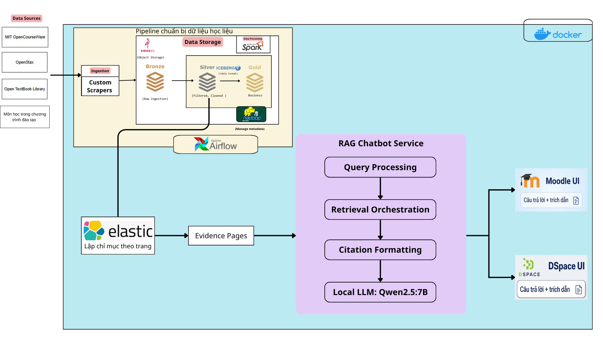

# OER Lakehouse - Hệ thống Quản lý & Tra cứu Tài nguyên Giáo dục Mở Thông minh

## Giới thiệu

**OER Lakehouse** là giải pháp kiến trúc Data Lakehouse toàn diện, được thiết kế để giải quyết bài toán thu thập, lưu trữ, chuẩn hóa và khai thác dữ liệu từ các nguồn tài nguyên giáo dục mở (OER) lớn trên thế giới như **MIT OpenCourseWare (OCW)**, **OpenStax**, và **Open Textbook Library (OTL)**. 

Dự án tích hợp sâu với kho lưu trữ số **DSpace 9**, kết hợp với công cụ tìm kiếm phân tích **Elasticsearch** và mô hình ngôn ngữ lớn **LLM (Ollama/Qwen2.5)** để cung cấp hệ thống chatbot trợ lý học tập (RAG) thông thái, có khả năng hiểu ngữ cảnh môn học và tìm kiếm chính xác đến từng trang tài liệu PDF.

---

## Sơ đồ Kiến trúc Hệ thống

Hệ thống hoạt động theo mô hình luồng dữ liệu tự động từ lúc thu thập đến khi phục vụ người dùng cuối:



---

## Tính năng Nổi bật

### 1. Thu thập Tự động & Kiến trúc Medallion (Apache Spark + Iceberg + MinIO)
* **Web Scraping**: Tự động crawl tài liệu, bài giảng, và giáo trình từ các nguồn học liệu mở. Lên lịch định kỳ qua Apache Airflow.
* **Bronze Layer**: Lưu trữ dữ liệu thô (PDF, metadata JSON) trực tiếp trên MinIO (S3-compatible).
* **Silver Layer**: Apache Spark xử lý tách trang PDF, làm sạch văn bản (bỏ header/footer), phân tích TOC và lưu dưới định dạng bảng Apache Iceberg.
* **Gold Layer**: Tổ chức Star Schema phục vụ báo cáo và đồng bộ dữ liệu.

### 2. Trợ lý Học tập RAG (Context-Aware Chatbot)
* Tích hợp chatbot thông minh trực tiếp vào **Moodle LMS** và **DSpace 9**.
* **Hiểu ngữ cảnh học tập**: Chatbot tự nhận diện thông tin môn học, chương mục (`course`, `section`, `activity`) và lịch sử trò chuyện để cá nhân hóa phản hồi.
* **Local LLM**: Kết nối **Qwen2.5:7b-instruct** chạy qua Ollama (có thể dùng mạng Tailscale) giúp bảo mật dữ liệu và dịch thuật thuật ngữ toán học chuyên sâu chuẩn xác.

### 3. Tìm kiếm Thông minh (Deep PDF Search)
* **Nested Page Indexing**: Lập chỉ mục nội dung ở cấp độ từng trang PDF riêng lẻ thay vì toàn bộ sách, giúp tìm kiếm đạt độ chính xác tối đa.
* **Thuật toán Tối ưu**: Kết hợp BM25 trên Elasticsearch với Gaussian Decay Scoring (ưu tiên tài liệu mới) và Highlight Snippets (hiển thị ngữ cảnh quanh từ khóa).

### 4. Hệ thống Gợi ý (Recommendation Engine)
* **Semantic Matching**: Ánh xạ tự động tài liệu với môn học theo chương trình đào tạo của sinh viên.
* **Content-based Filtering**: Đề xuất các tài liệu có nội dung tương đồng để mở rộng kiến thức.

### 5. Quản lý Kho lưu trữ (DSpace 9 Integration) & Tương tác
* **SAF Import**: Tự động đóng gói và import tài liệu vào repository của DSpace.
* **DSpace Angular Frontend**: Tích hợp giao diện Frontend tùy biến hỗ trợ hiển thị Tiếng Việt.
* **Rating & Review**: Cho phép sinh viên đánh giá, bình luận tài liệu và bình chọn tính hữu ích (helpful votes) gắn với tài khoản DSpace (eperson).

---

## Tech Stack

| Thành phần | Công nghệ | Phiên bản |
| :--- | :--- | :--- |
| **Data Storage** | MinIO | Latest |
| **Table Format** | Apache Iceberg | 1.4.2 |
| **Processing** | Apache Spark | 3.5.4 |
| **Orchestration** | Apache Airflow | 2.x |
| **Search Engine** | Elasticsearch | 8.15 |
| **Repository** | DSpace | 9.x |
| **Backend API** | FastAPI | Latest |
| **Frontend** | DSpace Angular | 9.1 |
| **Database** | PostgreSQL | 17 |

---

## Cấu trúc Thư mục Dự án

```
TLCN_OER_Lakehouse/
├── airflow/
│   ├── dags/                           # Các DAGs điều phối luồng xử lý
│   ├── src/                            # Code xử lý ETL cốt lõi (Bronze, Silver, Gold, ElasticSync)
│   └── Dockerfile
├── chatbot_api/                        # FastAPI cung cấp dịch vụ Chatbot
├── demo/
│   └── dspace-angular-fresh/           # DSpace 9 Angular Frontend (Custom Theme)
├── moodle/
│   └── local/oerchatbot/               # Plugin Chatbot tích hợp cho Moodle LMS
├── scripts/                            # Script cài đặt dữ liệu mẫu & khởi động
├── docker-compose.yml                  # Cấu hình deploy toàn bộ dịch vụ
└── README.md
```

---

## Hướng dẫn Khởi động Nhanh

### 1. Yêu cầu Hệ thống
* **RAM**: Khuyến nghị 16 GB (hệ thống chạy cụm Spark, Elasticsearch, Airflow, DSpace).
* **CPU**: Tối thiểu 4 Cores.
* **OS**: Ubuntu 20.04+, Windows 10/11 (WSL2), macOS.

### 2. Cấu hình Biến Môi trường
Tạo file `.env` tại thư mục gốc:
```bash
# Cấu hình kết nối Ollama GPU (Local hoặc qua Tailscale)
LOCAL_LLM_BACKEND=ollama
LOCAL_LLM_MODEL=qwen2.5:7b-instruct
LOCAL_LLM_BASE_URL=http://100.68.202.102:11434  # Thay bằng IP Ollama của bạn

# Các thông số timeout
PAGEINDEX_ASK_TIMEOUT=75
LOCAL_LLM_PROBE_TIMEOUT=10
```

### 3. Khởi động Các Dịch vụ
Khởi động cụm Lakehouse cốt lõi:
```bash
docker compose up -d
```
Khởi động hệ thống học tập Moodle LMS phụ trợ:
```bash
docker compose --profile lms up -d
```

---

## Hướng dẫn Cấu hình Chatbot trên Moodle LMS

1. Moodle có sẵn tại `http://localhost:18085` (Tài khoản: `admin` / `Admin@12345`).
2. Đi tới: `Site administration -> Plugins -> Local plugins -> OER Chatbot`.
3. Cấu hình **Chatbot API URL**: `http://host.docker.internal:18088/api/ask`.
4. Nếu sửa mã nguồn widget (`widget.js`), chạy lệnh sau để build và xóa cache:
   ```bash
   docker cp moodle/local/oerchatbot/amd/src/widget.js oer-moodle:/bitnami/moodle/local/oerchatbot/amd/build/widget.min.js
   docker exec oer-moodle php /bitnami/moodle/admin/cli/purge_caches.php
   ```

---

## API Endpoints

### Search & Chatbot API (`/api`)
| Method | Endpoint | Mô tả |
| :--- | :--- | :--- |
| GET | `/api/search?q={query}` | Tìm kiếm full-text |
| GET | `/api/resource/{id}` | Lấy thông tin chi tiết tài liệu |
| GET | `/api/recommend/{student_id}` | Gợi ý tài liệu cá nhân hóa |
| POST | `/api/ask` | Tương tác với LLM RAG Chatbot |

### Reviews API (`/api/reviews`)
| Method | Endpoint | Mô tả |
| :--- | :--- | :--- |
| GET | `/api/reviews/{resource_id}` | Lấy danh sách đánh giá |
| POST | `/api/reviews` | Thêm đánh giá mới |
| POST | `/api/reviews/{id}/helpful` | Bình chọn tính hữu ích |

---

## Airflow DAGs

| Tên DAG | Lịch chạy | Chức năng |
| :--- | :--- | :--- |
| `mit_ocw_scraper_daily` | 2:00 AM | Thu thập khóa học MIT OpenCourseWare |
| `openstax_scraper_daily` | 3:00 AM | Thu thập sách giáo trình OpenStax |
| `otl_scraper_daily` | 4:00 AM | Thu thập tài liệu từ Open Textbook Library |
| `silver_layer_processing` | Triggered | Chuyển đổi Bronze → Silver (Xử lý PDF/TOC) |
| `gold_layer_processing` | Triggered | Tổng hợp Silver → Gold Layer |
| `elasticsearch_sync_dag`| Triggered | Cập nhật chỉ mục tìm kiếm lên ES |
| `dspace_saf_import_dag` | Manual | Đóng gói SAF & Import vào DSpace |

---

## Cấu trúc Lưu trữ

### Database Schema (PostgreSQL)
```sql
eperson             -- Quản lý tài khoản (DSpace)
item                -- Tài liệu lưu trữ
metadatavalue       -- Metadata theo chuẩn Dublin Core
oer_reviews         -- Hệ thống đánh giá của người dùng
oer_review_helpful  -- Lượt bình chọn bài đánh giá
```

### Elasticsearch Index (Nested Mapping)
```json
{
  "oer_resources": {
    "mappings": {
      "properties": {
        "title": { "type": "text" },
        "source": { "type": "keyword" },
        "pdf_pages": {
          "type": "nested",
          "properties": {
            "page_number": { "type": "integer" },
            "content": { "type": "text" }
          }
        }
      }
    }
  }
}
```

---

## Địa chỉ Truy cập & Giám sát

| Dịch vụ | URL | Thông tin đăng nhập mặc định |
| :--- | :--- | :--- |
| **Hệ thống Airflow** | `http://localhost:8080` | `airflow` / `airflow` |
| **DSpace Frontend** | `http://localhost:4000` | `admin@dspace.org` / `dspace` |
| **Moodle Portal** | `http://localhost:18085` | `admin` / `Admin@12345` |
| **MinIO Console** | `http://localhost:9001` | `minioadmin` / `minioadmin` |
| **Spark Master UI** | `http://localhost:8081` | - |
| **Chatbot API**| `http://localhost:18088` | - |
| **Elasticsearch** | `http://localhost:9200` | - |

---

## Troubleshooting

| Sự cố | Cách giải quyết |
| :--- | :--- |
| **Out of memory** | Tăng mức giới hạn RAM trong Docker Desktop lên 12GB - 16GB. |
| **Lỗi Port conflict** | Dùng `netstat -an` tìm tiến trình đang chiếm port 8080/5432 và tắt đi. |
| **Timeout khi chat** | Cấu hình lại IP của Ollama trong `.env` và tăng `LOCAL_LLM_PROBE_TIMEOUT`. Lỗi này thường do mạng VPN/Tailscale chậm. |
| **Lỗi UI Chatbot lặp text**| Mở tab ẩn danh (Incognito) để dọn sạch `sessionStorage` cũ bị kẹt. |
| **Reset toàn bộ hệ thống** | Chạy lệnh `docker compose down -v` để làm sạch toàn bộ dữ liệu và container. |

---

## Tài liệu Tham khảo

- [MIT OpenCourseWare](https://ocw.mit.edu/)
- [OpenStax](https://openstax.org/)
- [Open Textbook Library](https://open.umn.edu/opentextbooks/)
- [DSpace Repository](https://dspace.org/)
- [Apache Spark](https://spark.apache.org/)
- [Elasticsearch](https://www.elastic.co/)
